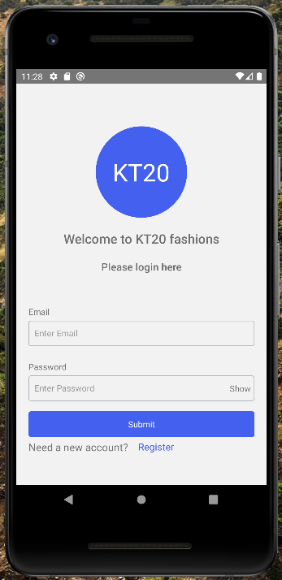
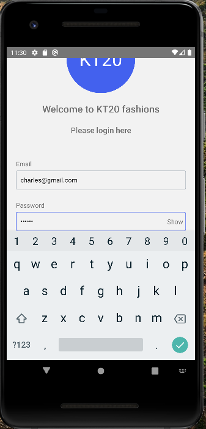
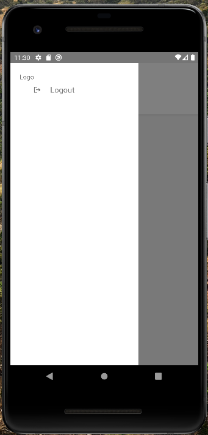
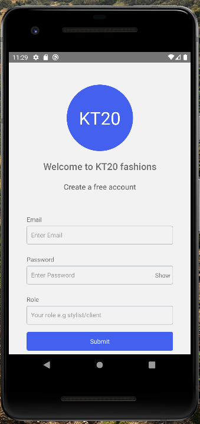

# KT20 FASHIONS
___




## Setting up the environment
Android development
### 1. Install Android Studio
[Download and install Android Studio](https://developer.android.com/studio/index.html). While on Android Studio installation wizard, make sure the boxes next to all of the following items are checked:

- Android SDK
- Android SDK Platform
- Android Virtual Device

### 2. Install the Android SDK
Android Studio installs the latest Android SDK by default. Building a React Native app with native code, however, requires the Android 10 (Q) SDK in particular. Additional Android SDKs can be installed through the SDK Manager in Android Studio.

### 3. Configure the ANDROID_HOME environment variable
The React Native tools require some environment variables to be set up in order to build apps with native code.

Add the following lines to your $HOME/.bash_profile or $HOME/.bashrc (if you are using zsh then ~/.zprofile or ~/.zshrc) config file:
```bash
  export ANDROID_HOME=$HOME/Android/Sdk
  export PATH=$PATH:$ANDROID_HOME/emulator
  export PATH=$PATH:$ANDROID_HOME/tools
  export PATH=$PATH:$ANDROID_HOME/tools/bin
  export PATH=$PATH:$ANDROID_HOME/platform-tools
```

### 4. Install packages
Inside the clone repository run yarn to install all the packages
```
yarn install
```

# Running the React Native application
### Step 1: Start Metro
To start Metro, run yarn start inside the React Native project folder:
  ```bash
  yarn start
  ```

### Step 2: Start the application
Open a new terminal inside your React Native project folder. Run the following:
```bash
  yarn android
```

If everything is set up correctly, you should see the app running in the Android emulator shortly.

__npx react-native run-android is one way to run your app - you can also run it directly from within Android Studio.__

For more details refer to [React Native environment-setup](https://reactnative.dev/docs/environment-setup)

